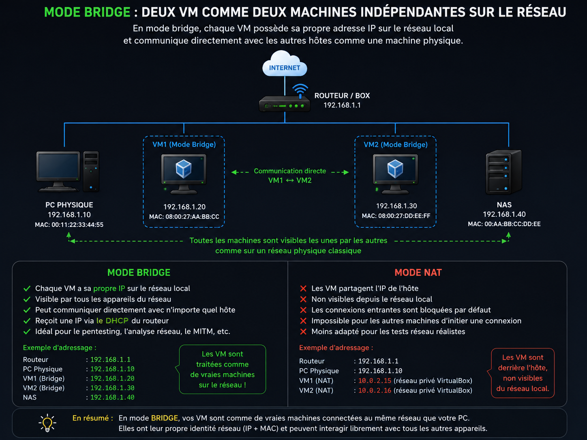
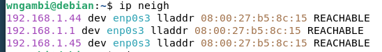
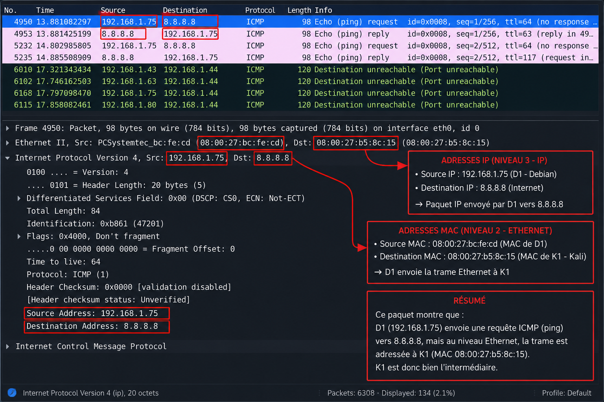

# Man-in-the-Middle (MITM) Lab

## Introduction

This project demonstrates how a Man-in-the-Middle (MITM) scenario can be observed and analyzed in a controlled laboratory environment using Kali Linux, Debian, Bettercap and Wireshark.

The purpose of this lab is to understand how network traffic can be redirected through an intermediary host, how Ethernet and IP communications behave during this process, and how to validate packet forwarding using network analysis tools.

At the end of the experiment, traffic generated by the Debian host (D1) is observed passing through the Kali Linux machine (K1), which acts as an intermediary between the victim host and the router.

---

## Objectives

* Understand the principles of a Man-in-the-Middle (MITM) scenario.
* Analyze Ethernet frames and IP packets using Wireshark.
* Understand the role of ARP cache manipulation in local networks.
* Observe packet forwarding between a host and a gateway.
* Troubleshoot common issues encountered during MITM laboratory setups.

---

## Lab Environment

* **Attacker / Intermediary:** Kali Linux (K1)
* **Victim:** Debian Linux (D1)
* **Tools:** Bettercap, Wireshark
* **Platform:** VirtualBox

---

## Network Topology

The lab contains two virtual machines:

* **K1:** Kali Linux
* **D1:** Debian Linux

### Network Configuration

Both virtual machines are configured in **Bridge Mode**.

In Bridge Mode, each virtual machine behaves like an independent device on the local network:

* It receives its own IP address.
* It has its own MAC address.
* It can communicate directly with the router and other hosts.
* It is visible to all devices on the local network.



---

## Attack Execution

### Step 1 – ARP Cache Manipulation

The first phase of the experiment consists of modifying the network neighbour information maintained by the victim host.

The objective is to make the victim associate the gateway IP address with the MAC address of K1.

ARP neighbour information can be displayed using:

```bash
ip neigh
```

#### D1 Neighbour Table



---

### Step 2 – Verify the Intermediary Role of K1

To generate traffic, ICMP Echo Requests are sent from D1:

```bash
ping -c 5 8.8.8.8
```


---

## Wireshark Analysis

The objective is to verify whether K1 is positioned between D1 and the router.

### ICMP Echo Request

When analyzing the Ethernet frame:

* The source MAC address corresponds to D1.
* The destination MAC address corresponds to K1.

This confirms that D1 sends its traffic to K1.



### ICMP Echo Reply

When analyzing the returning frame:

* The source MAC address corresponds to the router.
* The destination MAC address corresponds to K1.

This confirms that returning traffic is also received by K1 before reaching D1.


### Result

The captured traffic demonstrates that packets are traversing K1 in both directions.

The Kali host therefore acts as an intermediary between D1 and the gateway.

---

## Troubleshooting

During the implementation of this laboratory, several networking issues were encountered and resolved.

### 1. IP Forwarding

One of the most important requirements was enabling **IP Forwarding**.

#### What is Forwarding?

IP Forwarding is the ability of a system to receive packets that are not destined to itself and retransmit them to another device.

Without forwarding:

```text
Victim -> Kali -> X
```

Traffic stops at Kali.

With forwarding:

```text
Victim -> Kali -> Router
Router -> Kali -> Victim
```

Traffic continues normally while passing through the intermediary machine.

#### Verification

```bash
cat /proc/sys/net/ipv4/ip_forward
```

Expected value:

```text
1
```

---

### 2. ICMP Redirect Messages

Another issue encountered during testing was the generation of **ICMP Redirect** packets.

By default, Linux may attempt to optimize routing by informing hosts that a shorter path exists.

In our laboratory, these messages caused the victim to bypass the intermediary machine and communicate directly with the gateway.

This behavior prevented the traffic from consistently passing through K1.

#### Verification

```bash
cat /proc/sys/net/ipv4/conf/all/send_redirects
```

Expected value:

```text
0
```

When disabled, Linux no longer attempts to redirect hosts toward a more direct route.

This ensures that traffic continues to traverse the intermediary machine throughout the experiment.

---

### Lessons Learned

This laboratory provided practical experience with:

* Ethernet communications
* ARP neighbour tables
* Packet forwarding
* Gateway communications
* Wireshark traffic analysis
* Network troubleshooting

One of the key lessons learned is that understanding network fundamentals is essential when analysing or troubleshooting MITM scenarios. Small configuration details such as forwarding or ICMP redirects can significantly affect the outcome of an experiment.

---

## References

* Bettercap Documentation
* Wireshark Documentation
* Linux Networking Documentation
* TryHackMe Networking Fundamentals
* CompTIA Security+ Network Security Concepts

